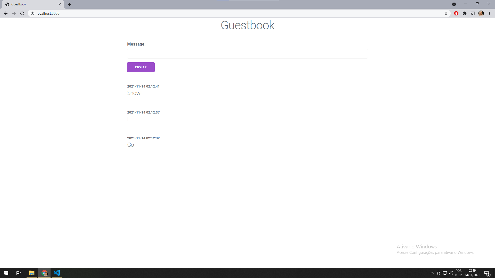

# Go guestbook

[PHP Version](https://github.com/hackergaucho/guest) by "Hacker gaucho"

[Ruby Version](https://github.com/leandronsp/guestbook) by "leandronsp"

  

## refs

- https://gowebexamples.com/templates/
- https://gowebexamples.com/forms/
- https://gobyexample.com/reading-files
- https://gobyexample.com/writing-files
- https://stackoverflow.com/questions/53737435/how-to-prepend-int-to-slice